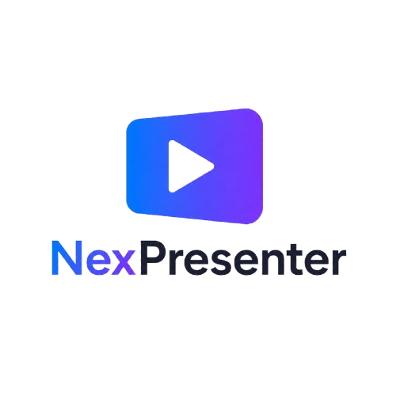



  

  <strong>A modern, fast, and open-source presentation software for churches and live events.</strong>

  
  

---

# NexPresenter

NexPresenter is a next-generation presentation application designed for churches, ministries, schools, conferences, and live productions.

Built with **C#**, **.NET**, and **Avalonia UI**, it aims to provide a modern alternative to traditional presentation software while remaining completely open source.

---

## ❤️ Contributing

Contributions, feature requests, and bug reports are always welcome.

If you'd like to help, feel free to open an issue or submit a pull request.

---

## 📄 License

Licensed under the MIT License.

See the [LICENSE](LICENSE) file for details.

---

Made for churches, ministries, schools, and live productions.

